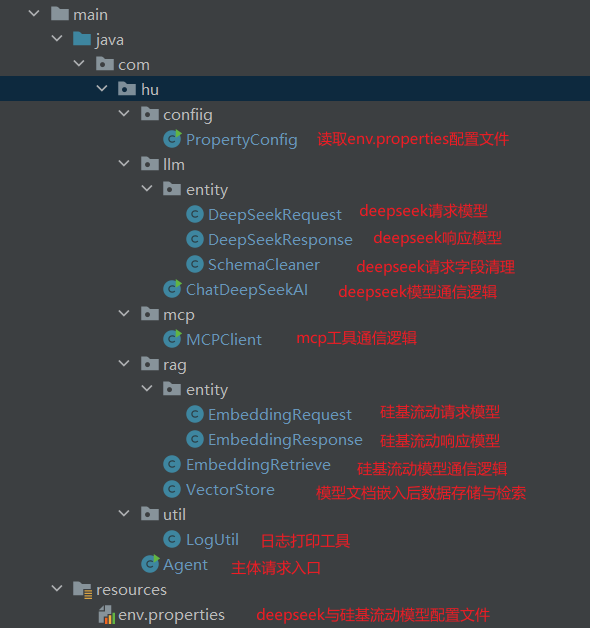
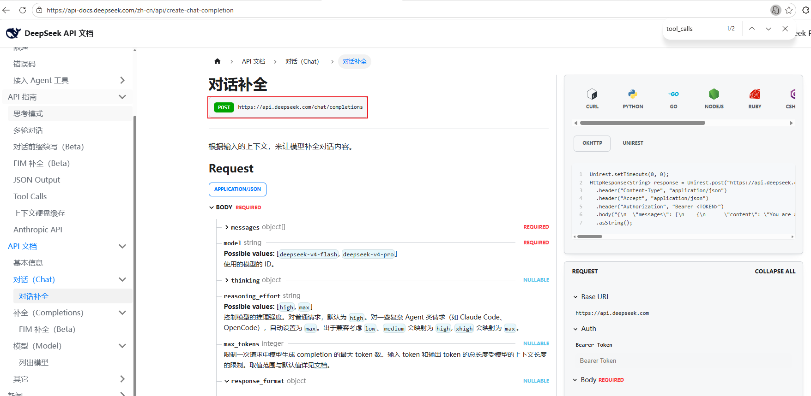
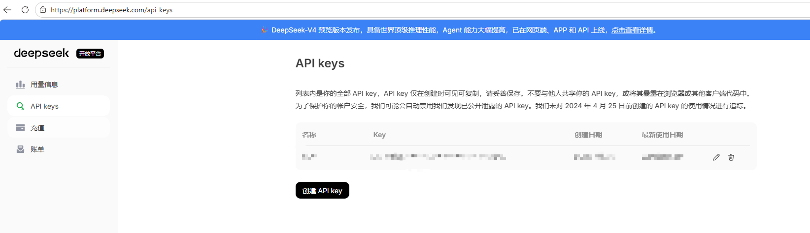
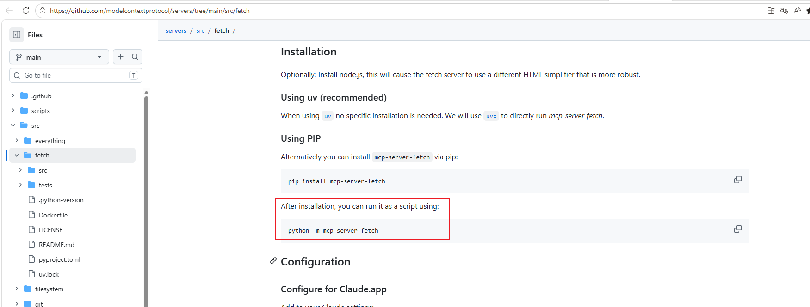
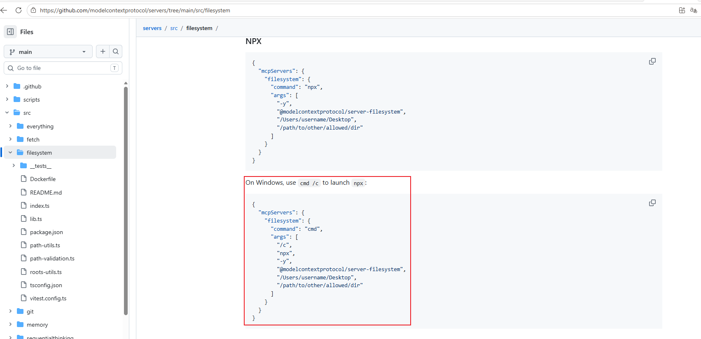
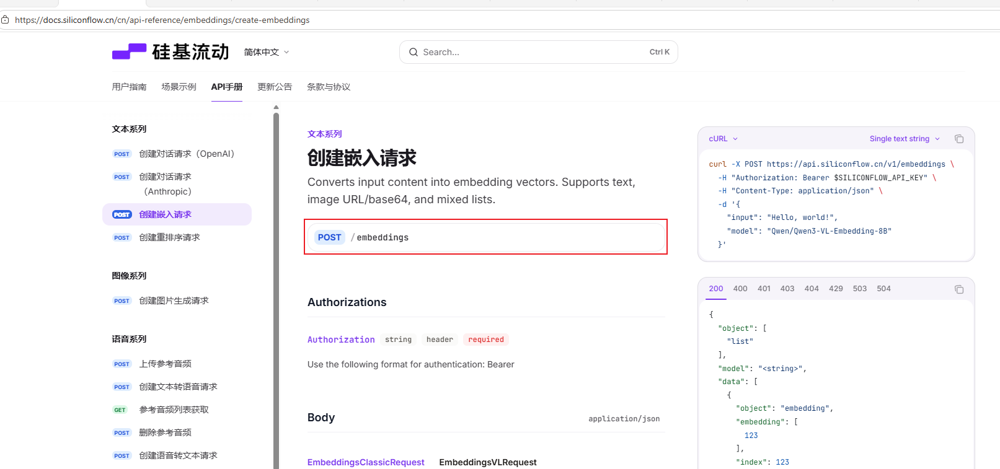
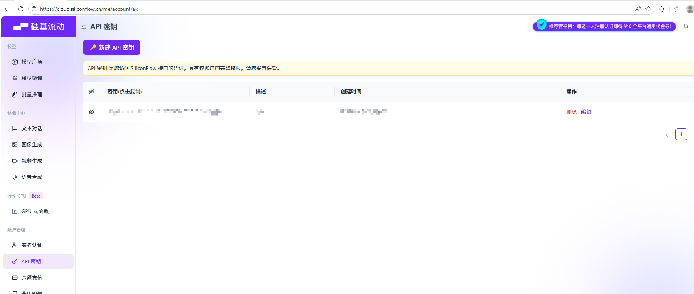

# LLM + MCP + RAG实战

## 项目资料

参考项目：https://github.com/KelvinQiu802/llm-mcp-rag

参考B站视频：https://www.bilibili.com/video/BV1dcRqYuECf/?buvid=XU8B949820D7D9F36B004117E0A9D791B0F35&from_spmid=main.my-history.0.0&is_story_h5=false&mid=tVoWgIx6NkuTPoT9w81hfw%3D%3D&plat_id=114&share_from=ugc&share_medium=android&share_plat=android&share_session_id=06f74510-2ff6-4d5f-a4d3-a7e797126f73&share_source=WEIXIN&share_tag=s_i&spmid=united.player-video-detail.0.0&timestamp=1777796593&unique_k=LIuRMzd&up_id=38563775&vd_source=981c575c2c198a33bb9e35bf97cb5d04

### LLM

DeepSeek文档：https://api-docs.deepseek.com/zh-cn/api/create-chat-completion

### MCP

MCP文档：https://modelcontextprotocol.io/docs/develop/build-client

Fetch MCP：https://github.com/modelcontextprotocol/servers/tree/main/src/fetch

Filesystem MCP：https://github.com/modelcontextprotocol/servers/tree/main/src/filesystem

### RAG

硅基流动文档：https://docs.siliconflow.cn/cn/api-reference/embeddings/create-embeddings

用户数据模拟：https://jsonplaceholder.typicode.com/users

## 项目结构

LLM：使用deepseek的deepseek-v4-flash模型

MCP：使用Fetch MCP和Filesystem MCP

RAG：使用硅基流动文本嵌入模型Qwen/Qwen3-VL-Embedding-8B




## 项目开发流程

### 大模型通信（LLM）

#### 1 配置大模型基础配置

env.properties文件

填写调用大模型URL和个人认证信息

大模型URL：https://api-docs.deepseek.com/zh-cn/api/create-chat-completion



个人认证信息：https://platform.deepseek.com/usage




#### 2 添加配置文件读取工具

PropertyConfig类

使用Properties读取配置文件，添加获取配置函数


#### 3 编写大模型请求响应实体

DeepSeekRequest和DeepSeekResponse

参考https://api-docs.deepseek.com/zh-cn/api/create-chat-completion链接构造需要的实体字段


#### 4 编写大模型通信逻辑

ChatDeepSeekAI类

1. 拼接大模型请求参数，添加user和system的上下文
2. 使用Unirest请求大模型接口
3. 处理大模型响应信息，添加响应信息给assistant，补充上下文信息


注意：多轮对话时，上一轮对话reasoning_reason也需要添加到assistant角色的上下文信息


#### 实验：

与大模型通信成功，获取返回信息

### 大模型调用工具（LLM + MCP）

#### 1 配置MCP依赖

pom引入io.modelcontextprotocol.sdk相关包

#### 2 本地安装工具

##### mcp_server_fetch工具

参考文档：https://github.com/modelcontextprotocol/servers/tree/main/src/fetch

```
// 工具安装
pip install mcp_server_fetch

// 工具运行
python -m mcp_server_fetch
```



##### server-filesystem工具

无需安装，windows可由下面命令直接执行，参考文档：https://github.com/modelcontextprotocol/servers/tree/main/src/filesystem

```
cmd /c npx -y @modelcontextprotocol/server-filesystem
```



#### 3 模拟MCP工具调用

MCPClient类

使用io.modelcontextprotocol.client.McpClient执行mcp工具信息获取


#### 4 大模型支持MCP工具调用

Agent类

1. 初始化工具，并获取工具信息
2. 大模型请求构造时添加tool信息
3. 大模型返回提供工具调用参数
4. 执行工具调用
5. 工具调用结果添加到tool角色信息，添加到大模型上下文
6. 与大模型持续对话，直至无需工具调用结束对话


注意：

1. deepseek仅支持部分mcp参数，因此对于从Fetch MCP和Filesystem MCP读取的参数需要进行过滤（SchemaCleaner实现）
2. 工具调用信息需要添加到assistant角色和tool角色的上下文信息，并且注意格式转换

#### 实验：

1. 爬取https://tech.sina.com.cn/news/的新闻内容，在本地生成新闻总结文档
2. 爬取https://jsonplaceholder.typicode.com/users的用户信息，本地为每个人创建基本信息文档


### 知识检索配合大模型调用工具（RAG + LLM + MCP）

#### 1 配置硅基流动基础配置

env.properties文件

填写调用硅基流动URL和个人认证信息

硅基流动URL：https://api.siliconflow.cn/v1/embeddings



个人认证信息：https://cloud.siliconflow.cn/me/account/ak



#### 2 编写硅基流动请求响应实体

EmbeddingRequest和EmbeddingResponse

参考https://docs.siliconflow.cn/cn/api-reference/embeddings/create-embeddings链接构造需要的实体字段

#### 3 编写硅基流动通信逻辑

EmbeddingRetrieve类

1. 拼接硅基流动模型请求参数，设置模型名称和待嵌入文档内容
2. 使用Unirest请求硅基流动模型接口
3. 处理硅基流动模型响应信息，获取编码向量结果


#### 4 编写向量存储和相似度检索逻辑

VectorStore类

1. 存储编码向量和文档内容映射关系
2. 支持向量间相似度计算
3. 支持获取已存储文档向量中与提示词向量最相似topN文档


#### 5 大模型添加RAG上下文信息

Agent类

1. 对已有文档执行向量编码，存储向量编码和文档内容关系
2. 对提示词执行向量编码
3. 查找提示词最相近topN文档
4. 文档信息添加到大模型上下文
5. 调用大模型开始对话


#### 实验：

在已有用户基本信息文档基础上，根据Kurtis-Weissnat的信息，创作一个她的故事保存到本地文件，要求生成文件包含基本信息和故事